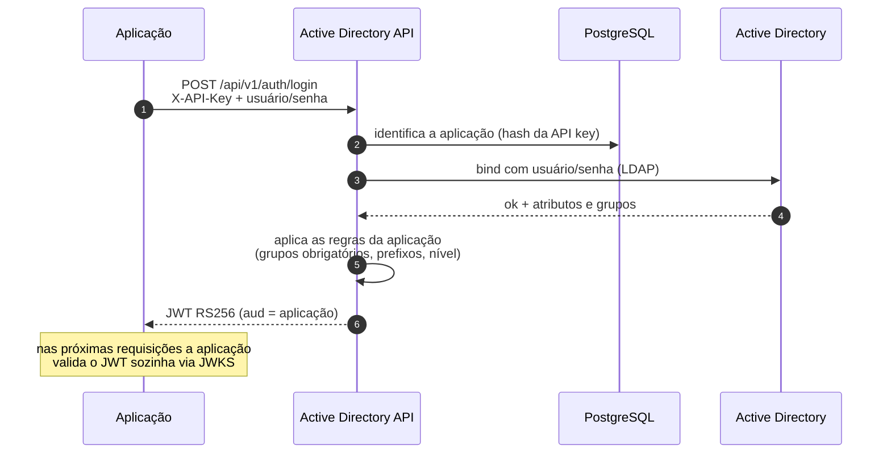

# Active Directory API

[](https://github.com/williamgsilva/active-directory-api/actions/workflows/ci.yml)


[](LICENSE)

Uma API pequena que centraliza a autenticação no **Active Directory on-premises**: as aplicações internas
param de falar com o AD diretamente e passam a pedir um login a ela, recebendo de volta um **JWT assinado**
com os dados e os grupos do usuário.

## Por que este projeto existe

O cenário é comum em empresas que usam AD: a primeira aplicação interna implementa o login no AD por
conta própria (conexão LDAP, bind, leitura de grupos). Funciona. Aí surge a segunda aplicação, a terceira...
e cada uma copia aquele trecho, com as mesmas configurações, os mesmos bugs e mais um lugar guardando
senha de conta de serviço.

Esta API nasceu para ser **o único lugar que fala com o AD**. Cada aplicação recebe uma API key, chama um
endpoint de login e recebe um token que ela mesma consegue validar, sem chamar a API de novo. Regras como
"esta aplicação só aceita quem está no grupo X" ou "esta outra só pode ver login e e-mail" ficam
configuradas por aplicação, num lugar só.

Durante o desenvolvimento, revisar o código de autenticação "de cada aplicação" também mostrou problemas
que este projeto corrige de propósito (ver [Decisões de projeto](#decisões-de-projeto)).

## Destaques

- **Login por usuário ou e-mail** — `nome.sobrenome`, `DOMINIO\nome.sobrenome` ou o e-mail cadastrado no
  atributo `mail` do AD. Nenhum domínio fica fixo no código.
- **JWT RS256 + JWKS** — as aplicações validam o token localmente em `/.well-known/jwks.json`.
- **Dois níveis de acesso por aplicação** — `basic` (só login, e-mail e status) ou `full` (dados completos,
  grupos, introspecção, autorização e consultas ao diretório).
- **Regras por aplicação** — prefixos de grupo que vão para o token, grupos obrigatórios para entrar,
  audiência (`aud`) própria: um token de uma aplicação não vale em outra.
- **Tudo no PostgreSQL** — aplicações e chaves de assinatura; mudanças valem **na hora, sem restart**.
- **Troca de chave sem derrubar ninguém** — a chave antiga continua validando os tokens já emitidos até
  eles expirarem.
- **Documentação protegida** — `/docs` e `/redoc` exigem usuário e senha por aplicação; aplicações `basic`
  só enxergam os endpoints básicos.
- **CLI de administração** — cadastro, edição, troca de API key e de chave JWT, sem mexer em arquivo.
- **Pronta para Docker Swarm** — bootstrap automático do banco, rolling update sem downtime.

## Como funciona



## Decisões de projeto

Algumas escolhas que valem explicar, porque cada uma corrige um problema real:

| Decisão | Por quê |
|---|---|
| **Uma conexão LDAP por requisição** | Uma conexão compartilhada (singleton) entre usuários mistura sessões quando há requisições simultâneas. |
| **Entradas escapadas antes de ir para o filtro LDAP** | Um login como `*` ou `a)(cn=*` não pode virar uma consulta diferente (LDAP injection). |
| **Senha vazia recusada antes do bind** | No AD, um simple bind com senha vazia vira *unauthenticated bind* e pode ser aceito sem validar nada. |
| **"Credencial inválida" ≠ "AD fora do ar"** | A aplicação recebe `401` ou `503`; o motivo real (senha expirada, conta bloqueada...) vai só para o log. |
| **JWT assimétrico (RS256)** | As aplicações validam o token com a chave pública, sem depender da API a cada requisição. |
| **API keys só como SHA-256; senhas da documentação com scrypt** | Quem lê o banco não consegue se passar por uma aplicação. |
| **Chave privada do JWT criptografada no banco** (Fernet, `APP_MASTER_KEY`) | O banco sozinho não permite emitir tokens. |
| **`pg_advisory_lock` no bootstrap** | Duas instâncias subindo juntas (rolling update) não criam tabelas nem chaves em duplicidade. |
| **Índice único parcial em `signing_keys`** | O próprio banco garante que nunca existem duas chaves ativas. |
| **Entrada do terminal sanitizada no CLI** | Apagar uma letra acentuada dentro de `docker run -it` deixa meio caractere UTF-8 para trás e quebrava o cadastro. |

## Stack

Python 3.13 · FastAPI · ldap3 · PyJWT · SQLAlchemy 2 + Alembic · PostgreSQL · Docker / Docker Swarm ·
pytest · GitHub Actions

## Começando

Pré-requisitos: Docker com Compose e acesso a um Active Directory (o login real depende dele; os testes
automatizados não).

```bash
git clone https://github.com/williamgsilva/active-directory-api.git
cd active-directory-api

# 1. Configuração local
cp config/app.env.example config/app.env
# Gera a APP_MASTER_KEY (chave Fernet) direto no arquivo
sed -i "s|^APP_MASTER_KEY=.*|APP_MASTER_KEY=$(openssl rand -base64 32 | tr '+/' '-_')|" config/app.env
# Preencha AD_SERVER, AD_DOMAIN, AD_BASE_DOMAIN e AD_USER no config/app.env

# 2. Senha da conta de serviço do AD, criptografada com a APP_MASTER_KEY
docker compose -f docker-compose.local.yml run --rm api python -m app.cli encrypt
#   informe a APP_MASTER_KEY do config/app.env e a senha; cole o AD_PASSWORD gerado no arquivo

# 3. Sobe API + PostgreSQL (o banco e a primeira chave JWT são criados sozinhos)
docker compose -f docker-compose.local.yml up -d --build
curl localhost:8282/health/ready      # {"status":"ok","database":"ok","active_directory":"ok"}

# 4. Cadastra a primeira aplicação (mostra a API key e a senha da documentação UMA vez)
docker compose -f docker-compose.local.yml run --rm api python -m app.cli add
```

Pronto: a documentação interativa fica em <http://localhost:8282/docs> (usuário e senha definidos no
cadastro) e o login em:

```bash
curl -X POST localhost:8282/api/v1/auth/basic/login \
  -H "X-API-Key: <api key>" -H "Content-Type: application/json" \
  -d '{"username": "nome.sobrenome@example.com", "password": "..."}'
```

```json
{
  "access_token": "eyJ...",
  "token_type": "Bearer",
  "expires_in": 28800,
  "user": { "login": "nome.sobrenome", "email": "nome.sobrenome@example.com", "is_active": true }
}
```

## Endpoints

Toda rota `/api/v1/*` exige o header `X-API-Key`. Cada aplicação tem um **nível de acesso**:

- **`basic`** (padrão): só os endpoints básicos; o token carrega apenas login e e-mail.
- **`full`**: também os endpoints completos. Uma aplicação `basic` que chama um deles recebe `403`.

| Método | Rota | Quem pode | O que faz |
|---|---|---|---|
| POST | `/api/v1/auth/basic/login` | qualquer aplicação | Valida usuário/senha e devolve JWT + `login`, `email`, `is_active` |
| POST | `/api/v1/auth/basic/introspect` | qualquer aplicação | Diz se um token é válido (login, e-mail, expiração) |
| POST | `/api/v1/auth/login` | `full` | Valida usuário/senha e devolve JWT + dados completos + grupos |
| POST | `/api/v1/auth/introspect` | `full` | Diz se um token é válido e devolve todos os claims |
| POST | `/api/v1/auth/authorize` | `full` | O dono do token está nos grupos informados? (`any` / `all`) |
| GET | `/api/v1/users/{login ou e-mail}` | `full` + diretório | Dados e grupos atuais de um usuário |
| GET | `/api/v1/groups/{grupo}/members` | `full` + diretório | Membros de um grupo (dentro dos prefixos da aplicação) |
| GET | `/.well-known/jwks.json` | público | Chave(s) pública(s) para validar os tokens |
| GET | `/health` · `/health/ready` | público | Liveness · readiness (banco + bind no AD) |

Validando o token na aplicação, sem chamar a API:

```python
import jwt

jwks = jwt.PyJWKClient("http://<servidor>:8282/.well-known/jwks.json")
key = jwks.get_signing_key_from_jwt(token)
claims = jwt.decode(token, key, algorithms=["RS256"], audience="<client_id>", issuer="active-directory-api")
```

O mapeamento "grupo do AD → permissão na aplicação" continua em cada aplicação: a API entrega os grupos,
não decide regras de negócio.

## Aplicações clientes

| Campo | Efeito |
|---|---|
| `access_level` | `basic` ou `full` |
| `group_prefixes` | (`full`) só grupos com estes prefixos vão para o token (ex.: `GRP_APP_`); vazio = todos |
| `required_groups` | o login só é aceito se o usuário estiver em pelo menos um destes grupos |
| `allow_directory_lookup` | (`full`) libera `/users` e `/groups` |
| `docs_username` / `docs_password_hash` | credencial da documentação; sem ela, a aplicação não abre `/docs` |

Administração pelo CLI (localmente com `python -m app.cli`, no servidor com `./admin.sh`):

```bash
./admin.sh              # menu
./admin.sh add          # nova aplicação (API key e senha da documentação aparecem uma única vez)
./admin.sh edit         # nível de acesso, grupos, documentação
./admin.sh list
./admin.sh rotate       # nova API key (a antiga para na hora)
./admin.sh remove
./admin.sh rotate-jwt   # nova chave de assinatura; a anterior vale até os tokens dela expirarem
./admin.sh keys         # chaves JWT ativas e aposentadas
./admin.sh encrypt      # criptografa senhas para o variables.env
```

## Produção (Docker Swarm)

No manager, numa pasta com `docker-project.yml`, `variables.env`, `start.sh`, `stop.sh` e `admin.sh`:

```bash
cp variables.env.example variables.env     # substitua os <...>
./admin.sh encrypt                         # APP_MASTER_KEY + AD_PASSWORD (e de novo para DATABASE_PASSWORD)
docker network create -d overlay backend   # se a rede ainda não existir (ou SWARM_NETWORK=<rede>)
./admin.sh init                            # cria tabelas + chave JWT e cadastra a primeira aplicação
./start.sh                                 # docker stack deploy
```

| O quê | Onde fica | Como muda | Quando vale |
|---|---|---|---|
| AD, banco, `APP_MASTER_KEY`, JWT | `variables.env` | editar o arquivo | `./start.sh` |
| Aplicações clientes | PostgreSQL | `./admin.sh add/edit/rotate/remove` | na hora |
| Chave de assinatura | PostgreSQL | `./admin.sh rotate-jwt` | em até 30 s |

O serviço sobe com `order: start-first` e healthcheck: atualizar não derruba a API. Variáveis da stack:
`REGISTRY` (padrão `ghcr.io/williamgsilva`), `IMAGE_TAG`, `APP_PORT` (padrão `8282`) e `SWARM_NETWORK`.

> **`APP_MASTER_KEY` não pode mudar** depois de criada: a chave JWT guardada no banco só abre com ela.

## Testes

```bash
poetry install
poetry run pytest
```

Os testes rodam com SQLite em memória e um AD simulado (`ldap3` em modo mock): não precisam de banco
nem de AD. Cobrem login (usuário e e-mail), níveis de acesso, audiência, documentação protegida, troca de
chave com período de transição, bootstrap idempotente, LDAP injection e o caso dos bytes quebrados no
terminal. O GitHub Actions roda a suíte a cada push e publica a imagem no GHCR a cada tag `v*`.

Há também uma collection do Postman em [`docs/postman/`](docs/postman/) com todos os endpoints; o login
salva o token automaticamente para as demais requisições.

## Estrutura

```
app/
├── ad/client.py        # integração com o AD (bind, busca, grupos, login por e-mail)
├── api/                # rotas (básicas, completas, diretório), docs protegidas, schemas
├── core/               # configuração, aplicações clientes, tokens JWT, chaves, criptografia
├── db/                 # modelos SQLAlchemy, sessão e migrations (Alembic)
├── bootstrap.py        # migrations + primeira chave JWT, com advisory lock
└── cli.py              # administração
tests/                  # pytest (SQLite + AD simulado)
docker-compose.local.yml · docker-project.yml · admin.sh · start.sh · stop.sh
```

## Limitações e próximos passos

Sendo honesto sobre o que esta API **não** faz:

- **As aplicações recebem a senha do usuário** e a repassam para a API (o padrão "formulário de login
  próprio"). Para SSO, MFA e login sem expor senha às aplicações, o caminho é um provedor OIDC — um
  Keycloak federado ao AD, por exemplo. Esta API resolve bem o cenário de aplicações internas simples.
- **Sem rate limit próprio**: o bloqueio por tentativas fica a cargo da política de lockout do AD.
- **Use LDAPS (`AD_SSL=true`) em produção**: sem TLS, a senha trafega em texto até o AD.
- Ideias: rate limit por aplicação, log de auditoria em tabela, endpoint de logout/revogação, manifests
  para Kubernetes.

## Licença

[MIT](LICENSE) © William Gonçalves da Silva
